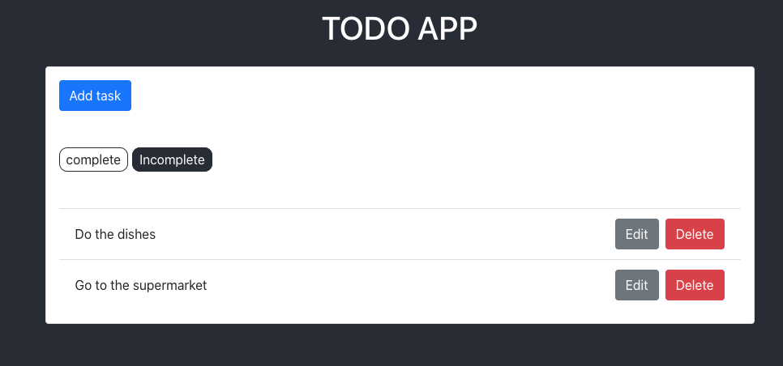
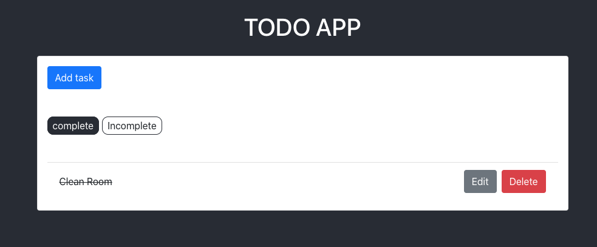
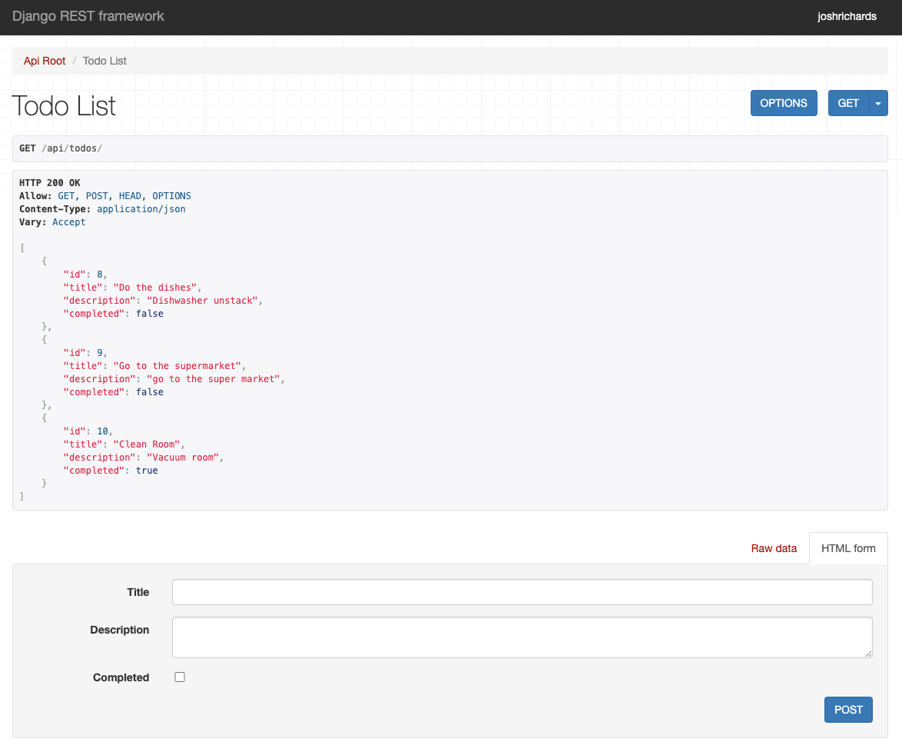

# TodoList Web Application

This is a full stack todo list web application using

- React for the frontend
- Django REST API for the backend
- Bootstrap for the styling

It is based off the online resource https://scotch.io/tutorials/build-a-to-do-application-using-django-and-react and was used to learn about these technologies.

